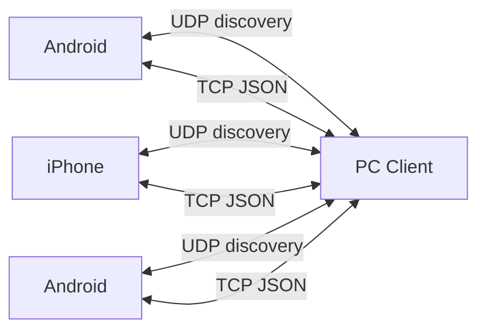

# LynkLAN Architecture

## High-level Diagram

## Components
- Discovery Service: UDP broadcast request/response.
- Connection Manager: TCP server/client, peer lifecycle.
- Protocol Handler: JSON encoding, message validation.
- File Transfer: chunked file streaming.
- Optional Security: HMAC and encryption hooks.
