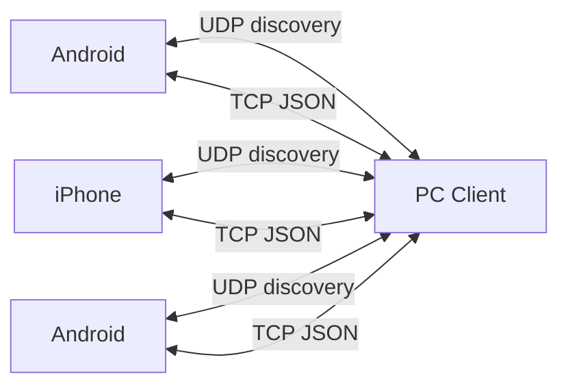

# LynkLAN Architecture

## High-level Diagram

## Components
- Discovery Service: UDP broadcast request/response.
- Connection Manager: TCP server/client, peer lifecycle.
- Protocol Handler: JSON encoding, message validation.
- File Transfer: chunked file streaming.
- Optional Security: HMAC and encryption hooks.

## Messaging Logic

### Direct (One-to-One)
- Each peer is addressed by `device_id` over a TCP connection.
- Messages are stored locally per peer and replayed from history on demand.

### Conference (Group)
- Each group has a master that relays messages to all members.
- Peers must accept an invite before joining.
- If the master is offline, an active member is elected as the new master.
- Messages are stored locally per group and replayed from history on demand.
