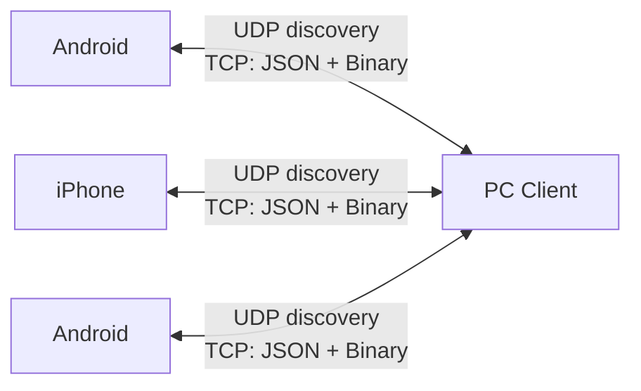

# LynkLAN Architecture

## High-level Diagram



## Components

### Discovery Service (UDP, Port 50000)
Continuously broadcasts device presence and listens for other devices.
- **Broadcast interval:** Every 3 seconds
- **Message:** `discovery_request` with device_id, name, platform, IP, TCP port
- **Response:** Unicast `discovery_response` back to requester
- **Why:** Enables peers to find each other without central server; automatic on network changes

### Connection Manager (TCP, Port 60000)
Central coordinator for all peer connections and message routing.
- **Accept thread:** Listens for inbound connections
- **Read thread (per peer):** Blocks on socket recv, multiplexes JSON and binary frames
- **Send lock (per peer):** Protects socket writes from concurrent corruption
- **Message routing:** Dispatches to appropriate handler based on message type

### Protocol Handlers

#### JSON Protocol (Text messages, metadata)
**Frame format:**
```
[L][M][E][S][S][A][G][E]
^       ^
|       \___ JSON string (variable length)
\__________ 4-byte big-endian length prefix (excludes this field)
```

**Characteristics:**
- All message types except file chunks use JSON
- Human-readable, easy to extend
- Small overhead for text messages (<1 KB)
- Suitable for control messages and chat

**Message types:**
- `handshake`: Peer identity exchange (device_id, name, platform)
- `message`: Direct 1-to-1 text message
- `group_message`: Group chat message (relayed by master)
- `group_invite`: Master invites peer to group (includes group_id, name)
- `group_join`: Peer requests to join group (sent to master)
- `group_join_ack`: Master confirms peer joined
- `group_join_reject`: Master rejects peer join request
- `group_master`: Announces new group master/membership
- `file_meta`: File metadata (legacy JSON mode)
- `file_chunk`: File data (legacy JSON mode with Base64)

#### Binary Protocol (File chunks only)
**Frame format (zero-copy optimized):**
```
[4 bytes] Frame length (big-endian)
[3 bytes] Magic 'BIN' (0x42 0x49 0x4E)
[1 byte]  Frame type
[PAYLOAD depends on frame type]
[4 bytes] CRC32 checksum
```

**File Metadata Frame (0x01):**
```
[1 byte]  Type: 0x01
[16 bytes] File ID (UUID as raw bytes)
[8 bytes]  File size (uint64 big-endian)
[1 byte]   Compression flag (0x00=none, 0x01=lz4, 0x02=gzip)
[2 bytes]  Filename length (uint16)
[N bytes]  Filename (UTF-8)
[4 bytes]  CRC32
```

**File Chunk Frame (0x02):**
```
[1 byte]   Type: 0x02
[16 bytes] File ID (same UUID from metadata)
[4 bytes]  Chunk index (uint32, supports out-of-order delivery)
[4 bytes]  Chunk size (uint32, actual bytes)
[N bytes]  Raw file data (no Base64 encoding!)
[4 bytes]  CRC32 of data
```

**Characteristics:**
- Raw binary, no Base64 encoding (~40-50% faster)
- Large chunks (512 KB vs 64 KB for JSON) reduce overhead
- CRC32 corruption detection
- Chunk indices future-proof for parallel transfers
- Magic 'BIN' distinguishes from JSON (0x7B = '{')

### Protocol Detection & Multiplexing

**Runtime detection:**
```python
first_byte = sock.recv(1, MSG_PEEK)
if first_byte == 0x7B:      # '{' → JSON
    handle_json_message()
elif first_byte == 0x42:    # 'B' → Binary (from 'BIN')
    handle_binary_frame()
```

**Why this works:**
- 0x7B ('{') is how JSON always starts
- 0x42 (0x42 0x49 0x4E = 'BIN') cannot occur in JSON
- No special markers needed; protocol auto-detected
- Both coexist seamlessly on same socket

**Socket Write Protection:**
```python
class PeerConnection:
    send_lock = threading.Lock()
    
    def send(self, message):
        with self.send_lock:  # Only one thread sends at a time
            sock.sendall(payload)
```

**Why needed:**
- Multiple threads may call send() simultaneously:
  - CLI user sends text message
  - Connection manager relays group message
  - File sender transmits chunk
- Without lock, bytes interleave, corrupting frame boundaries
- Lock is per-peer (different peers can send in parallel)

### File Transfer Module

#### Sender (FileSender class)
- **Generator pattern:** Yields frames one at a time (no full buffering)
- **Protocol auto-selection:**
  - Binary mode (default): Efficient, 512 KB chunks
  - JSON mode (legacy): Base64, 64 KB chunks, compatibility
- **Chunk generation:**
  ```python
  for chunk in file.read(512KB):
      yield encode_binary_file_chunk(file_id, chunk_index, chunk)
      chunk_index += 1
  ```

#### Receiver (FileReceiver class)
- **Progress callbacks:** UI updates on each chunk
- **Filename sanitization:** Prevents path traversal (`../../etc/passwd`)
- **Disk streaming:** Writes chunks immediately (memory-efficient)
- **Chunk tracking:** Stores received[chunk_index] for resume (future)
- **Output path:** Files saved to `received/` subdirectory

#### Safety Features
- **Max file size:** 10 GB (prevents uint64 overflow)
- **Max chunk size:** 10 MB (prevents memory exhaustion)
- **Filename length limit:** 1024 bytes (UTF-8 safe)
- **CRC32 checksums:** Detects transmission corruption
- **Null bytes removed:** Prevents C-string termination attacks
- **Path components removed:** Prevents directory traversal

### Storage Module (ChatStore)

**Persistence model:**
```
data/
  ├── state.json              # Group metadata (atomic)
  ├── direct_<peer_id>.jsonl  # 1-to-1 messages (append-only)
  └── group_<group_id>.jsonl  # Group messages (append-only)
```

**Format (JSONL = one JSON object per line):**
```
{"type":"message","device_id":"...","timestamp":1702500000,"payload":{"text":"hello"}}
{"type":"message","device_id":"...","timestamp":1702500010,"payload":{"text":"world"}}
```

**Why JSONL:**
- Fast appends (single write per message)
- Tail-only reads for recent history
- Easy to replay/audit
- Parseable even if last line incomplete
- Works on all filesystems (no special requirements)

**Group state (state.json):**
```json
{
  "groups": {
    "group_uuid": {
      "name": "Friends",
      "members": ["peer1_id", "peer2_id"],
      "master_id": "peer1_id",
      "epoch": 1702500000
    }
  }
}
```

**Rationale:**
- Single file for groups (atomic updates prevent race conditions)
- JSONL for messages (independent, no locking overhead)
- Epoch field lets master election resolve conflicts deterministically

### Discovery Service (UDP)

**Broadcast strategy:**
```
Timer fires every 3 seconds:
1. Create discovery_request message
2. Send to 255.255.255.255:50000 (broadcast)
3. All peers on LAN receive it
4. Responding peers send unicast discovery_response
5. Callback notifies UI of new/seen devices
```

**Why broadcast, not multicast:**
- Multicast often blocked/requires IGMP
- Broadcast simpler and more reliable on home networks
- Works on WiFi hotspots and private LANs

**Peer discovery lifecycle:**
```
Send broadcast → Receive response → Add to discovered dict
              ↑                  ↓
              ←────── repeat ────←
```

**Continuous operation:**
- Broadcasts keep running in background
- New devices appear within 3-6 seconds
- Devices stay "visible" while broadcasting
- Stops responding when app exits

## Messaging Logic

### Direct (One-to-One) Communication
**Characteristics:**
- Peer-to-peer over TCP, addressed by `device_id`
- No relay, no master
- Messages bidirectionally stored

**Message flow:**
```
Sender                    Network              Receiver
------                    -------              --------
  │ send_text(peer_id)       │
  ├─ Create "message" type   │
  ├─ Encode as JSON          │
  ├─ Lock socket; sendall    │
  │              ──────────► │ Receive bytes
  │                          ├─ Peek first byte '{'
  │                          ├─ Read JSON message
  │                          ├─ on_text callback
  │                          ├─ Write to direct_<peer_id>.jsonl
  │                          └─ UPDATE UI
```

**Storage pattern:**
- Both peers store message in their local `direct_<peer_id>.jsonl`
- Sender stores immediately (local backup)
- Receiver stores on arrival (redundancy)
- History retrieved from disk when user requests

**Why bidirectional storage:**
- Survives if one peer crashes/disconnects
- Enables offline message replay
- Prevents sender-only messages disappearing

### Conference (Group) Communication
**Master-Relay Architecture:**

```
[Peer A] ──┐
           ├─→ [Master] ──→ [Peer B]
[Peer C] ──┘                ──→ [Peer D]
```

**Why master relay:**
- Single source of truth for message ordering
- Prevents fork/divergence (all see same sequences)
- Simplifies consistency (no quorum needed)
- Fallback election handles master offline

**Message flow:**

1. **Create Group (Peer A becomes master):**
   ```
   create_group("Friends") 
   → store.create_group(name, [A], master_id=A)
   → broadcast_group_master() to connected peers
   ```

2. **Invite Members (Master only):**
   ```
   invite_to_group(group_id, [B, C, D])
   → for each peer: send group_invite message
   → Master includes group metadata in invite
   ```

3. **Peer Accepts (Peer B):**
   ```
   accept_group_invite(group_id)
   → store.upsert_group (adds self to members)
   → send group_join to master
   ```

4. **Master Confirms:**
   ```
   receive(group_join)
   → store.update_group (add new member)
   → send group_join_ack to peer
   → broadcast_group_master() (announces updated members)
   ```

5. **Send Group Message (Peer C):**
   ```
   send_group_message(group_id, "hello")
   → elect_master() if current master offline
   → if (we_are_master):
         store.append_group(message)
         relay_to_all_members(message)
     else:
         send to master (we're slave)
   ```

6. **Master Relays:**
   ```
   receive(group_message)
   → store.append_group(message)
   → send group_message to all other members
   ```

**Master Election (Fallback):**

```python
def _elect_master(active_members: Set[str]) -> str:
    """Deterministic election prevents conflicts."""
    return sorted(active_members)[0]  # Lexicographically first
```

**Why deterministic:**
- All peers compute same result independently
- No network messages needed for election
- Remains stable until someone with lower ID joins/comes online

**Example:**
```
members = {A, B, C, D}
active = {A, C, D}  # B offline
master = sorted(active)[0]
# All three compute: "A" (no coordination required)
```

**When to elect new master:**
- Send group message and master not in active_members
- Current master epoch outdated
- Peer join fails (master can't be reached)

**Member State Tracking:**
- Local copy in `state.json` under group record
- On any state change (join/leave), epoch updated
- Higher epoch always wins (prevents old data)

## File Transfer Flow

### Sender-Initiated Transfer
```
User: sendfile <peer_id> /path/to/file.pdf
│
└─ FileSender(path, use_binary=True)
   ├─ Generate file_id (UUID)
   ├─ Yield: encode_binary_file_meta(...)
   │  └─ Contains: filename, size, compression_flag
   │
   ├─ For each 512 KB chunk:
   │  └─ Yield: encode_binary_file_chunk(file_id, index, data)
   │     └─ Contains: raw bytes + CRC32
   │
   └─ ConnectionManager.send_file()
      └─ For each message:
         ├─ Lock socket (thread-safe)
         ├─ sock.sendall(payload)
         └─ Callback: progress_update(bytes_sent, total)
```

### Receiver-Side Processing
```
Receive binary frame
│
├─ First byte 0x42? → Yes, read_binary_frame()
│
├─ Frame type?
│
├─ 0x01 (metadata):
│  ├─ Decode: file_id, filename, size
│  ├─ Sanitize filename
│  ├─ FileReceiver(file_id, filename, size)
│  └─ Open received/<sanitized_name>
│
└─ 0x02 (chunk):
   ├─ Decode: file_id, chunk_index, data, crc32
   ├─ Verify CRC32 (detect corruption)
   ├─ receiver.write_chunk_binary(chunk_index, data)
   ├─ Track bytes_written
   ├─ If complete: close() and notify UI
   └─ Callback: progress_update(bytes_received, total)
```

### Progress Tracking
- Sender: `bytes_sent / total_size`
- Receiver: `bytes_written / total_size`
- Callback executed after each chunk: `progress_callback(received, total)`
- UI updates progress bar in real-time

### Error Handling
- **CRC32 mismatch:** Log error, close connection, user retries
- **Filename invalid:** Sanitized before writing
- **File permission error:** Exception caught, user notified
- **Network disconnect mid-transfer:** TCP connection reset, user can retry
- **Receiver out of disk space:** Write fails, user notified

## Future Enhancements

### Resume Support
- Track sent/received chunk indices persistently
- On reconnect: compare lists, send only missing chunks
- Requires: ACK messages and chunk tracking

### Parallel Transfers
- Send chunks 0, 1, 2, 3, ... in pipeline (not awaiting ACK)
- Multiple TCP windows in flight simultaneously
- Requires: Chunk indexing (already in place)

### Compression
- Detect file type (text vs binary)
- Auto-compress if beneficial (>10% reduction)
- Flag in metadata so receiver decompresses
- LZ4 for speed, GZIP for ratio

### Encryption
- TLS wrapper on TCP socket (standard approach)
- Or per-message encryption (more flexible)
- Requires: Key exchange or pre-shared secrets

### Voice/Video Calling
- Same discovery, different message types
- UDP for low-latency audio/video (separate from TCP chat)
- RTP/WebRTC payloads, or custom codecs

